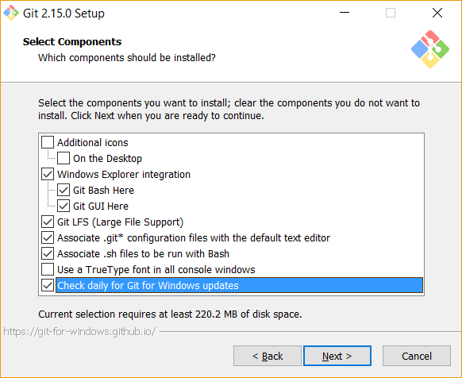
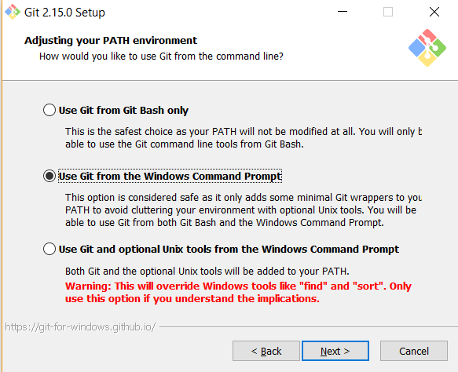
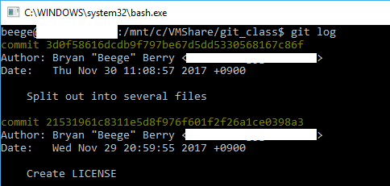

# Git

## Install Git
[Download it!](https://git-scm.com/downloads)

### Windows
All defaults are okay except those listed below.
##### Check the components you're going to install
The `X Here` utility is really useful.
`Check daily for Git for Windows updates` keeps Git updated. This is always a good idea.



##### Choose your PATH settings
For those less familiar with command line (CLI), the PATH is the list of folders where the operating system will look for executable files. By adding it to the Windows PATH, you can use Git commands from the normal CLI.
Git will also install Git Bash, a Unix-style alternative to the Windows CLI.



### Mac
TBD

## Configure Git
We should tell Git who we are. By doing this, when we push our code up to Gitlab, it knows to tag us with our profile. It keys off of the email; the name does not need to match exactly.
```
git config --global user.name
git config --global user.email
```

## Setup your project
1. Create a folder for your project.
2. Navigate into this folder using the command line.
3. Run `git init` to create the git repository
    * This creates a `.git` folder that contains a config file (`.git/config`), all of your history, branches, and more.
4. Check the status of your repository with `git status` to ensure it was created properly.
5. Create a `.gitignore` file to ignore files you don't want to track
    * This is useful for ignoring compiled files or configuration files that you don't want polluting your source control.
    1. Create a file called `.gitignore` in your project folder
    2. Go to [gitignore.io](https://www.gitignore.io/)
    3. Enter the things you're using related to the project
        - If you're writing Python using PyCharm and Pipenv on Windows, you might enter `Python`, `Pycharm+iml`, `VirtualEnv`, `Windows`
    4. Hit Create
    5. Copy the results into your `.gitignore` file and save
6. Run `git status` again to see the state of the repository
    * You'll notice that the `.gitignore` file appears as an "unstaged" change
7. Run `git add .gitignore` to staging
    * Staging a file tells Git that we plan on including that file in our commit/checkpoint
8. Run `git commit -m "Added gitignore"`
    * This creates a new commit with the message "Added gitignore"
9. Run `git status` to see that the working directory is now "clean" - there are no differences between your current files and the last commit

## So what just happened?
We created a new Git repository, created a new file, staged it, and committed it. This is the beginning of the history for this project. Still having trouble understanding history? Run this:
```
git log
```
You should get something that looks kind of like this:


This shows you the author of the commit, a timestamp of when it happened, and a message ideally describing the changes made in the commit.

You'll also notice a long string of numbers and letters. That's called a `hash`. Each commit gets its own unique hash, used to identify itself. It's basically a fancy ID.

-- make changes
diff
reset
-- make more changes
checkout -- file
branch
checkout branch
checkout -b branch
-- add another file
rm
merge
branch -d branch
--make change
add, commit
log
revert
tag <version>
-- make changes, add, commit
tag -a <version> -m <message>
show <tag>
