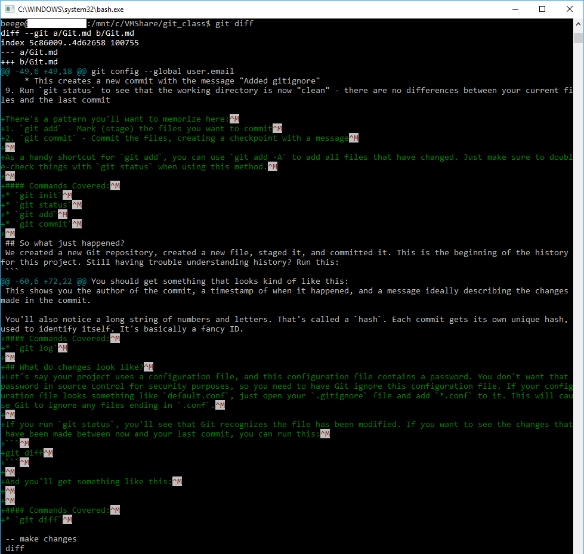

# Git

## Install Git
[Download it!](https://git-scm.com/downloads)

### Windows
All defaults are okay except those listed below.
##### Check the components you're going to install
The `X Here` utility is really useful.
`Check daily for Git for Windows updates` keeps Git updated. This is always a good idea.


##### Choose your PATH settings
For those less familiar with command line (CLI), the PATH is the list of folders where the operating system will look for executable files. By adding it to the Windows PATH, you can use Git commands from the normal CLI.
Git will also install Git Bash, a Unix-style alternative to the Windows CLI.


### Mac
TBD

## Configure Git
We should tell Git who we are. By doing this, when we push our code up to Gitlab, it knows to tag us with our profile. It keys off of the email; the name does not need to match exactly.
```
git config --global user.name
git config --global user.email
```

## Setup your project
1. Create a folder for your project.
2. Navigate into this folder using the command line.
3. Run `git init` to create the git repository
    * This creates a `.git` folder that contains a config file (`.git/config`), all of your history, branches, and more.
4. Check the status of your repository with `git status` to ensure it was created properly.
5. Create a `.gitignore` file to ignore files you don't want to track
    * This is useful for ignoring compiled files or configuration files that you don't want polluting your source control.
    1. Create a file called `.gitignore` in your project folder
    2. Go to [gitignore.io](https://www.gitignore.io/)
    3. Enter the things you're using related to the project
        - If you're writing Python using PyCharm and Pipenv on Windows, you might enter `Python`, `Pycharm+iml`, `VirtualEnv`, `Windows`
    4. Hit Create
    5. Copy the results into your `.gitignore` file and save
6. Run `git status` again to see the state of the repository
    * You'll notice that the `.gitignore` file appears as an "unstaged" change
7. Run `git add .gitignore` to staging
    * Staging a file tells Git that we plan on including that file in our commit/checkpoint
8. Run `git commit -m "Added gitignore"`
    * This creates a new commit with the message "Added gitignore"
9. Run `git status` to see that the working directory is now "clean" - there are no differences between your current files and the last commit

There's a pattern you'll want to memorize here:
1. `git add` - Mark (stage) the files you want to commit
2. `git commit` - Commit the files, creating a checkpoint with a message

As a handy shortcut for `git add`, you can use `git add -A` to add all files that have changed. Just make sure to double-check things with `git status` when using this method.

#### Commands Covered:
* `git init`
* `git status`
* `git add`
* `git commit`

## So what just happened?
We created a new Git repository, created a new file, staged it, and committed it. This is the beginning of the history for this project. Still having trouble understanding history? Run this:
```
git log
```
You should get something that looks kind of like this:


This shows you the author of the commit, a timestamp of when it happened, and a message ideally describing the changes made in the commit.

You'll also notice a long string of numbers and letters. That's called a `hash`. Each commit gets its own unique hash, used to identify itself. It's basically a fancy ID.
#### Commands Covered:
* `git log`

## What do changes look like?
Let's say your project uses a configuration file, and this configuration file contains a password. You don't want that password in source control for security purposes, so you need to have Git ignore this configuration file. If your configuration file looks something like `default.conf`, just open your `.gitignore` file and add `*.conf` to it. This will cause Git to ignore any files ending in `.conf`.

If you run `git status`, you'll see that Git recognizes the file has been modified. If you want to see the changes that have been made between now and your last commit, you can run this:
```
git diff
```

And you'll get something like this:


This may look confusing at first, but we can make sense of it.

The first line shows us the files being compared. `a` and `b` represent difference versions. Index is referencing the commit hashes. `a` is before. `b` is after.

Between the `@@`s describes the section of the file where the upcoming chunk of code came from. `-49,6` means it was line `49` of the original file (`-`) and was `6` lines long. The second file (`+`) also started at line `49` but is now `18` lines long.

Following this is a listing of the changed code. Lines with no symbol before them or color are unchanged. Lines starting with a `+` are new in the `b` version. Lines starting with a `-` were in the `a` version but removed in the `b` version.

#### Commands Covered:
* `git diff`

## How do we undo changes?
### Reset
You can use `git reset --hard` to remove any changes you've made to the code since the last commit.
If you've staged a change with `git add` and want to unstage it , you can use `git reset` alone. This will not change the files themselves.
If you want to undo commits and remove them from history as if they've never happened, you can use `git reset <commit>` where `<commit>` is the hash of the commit you want to return to. You can also use notation like `HEAD~3` to go back by 3 commits. **Be careful**. Only do commands that rewrite history like this on branches only you have touched. Avoid doing this on a master branch.

#### Commands Covered:
* `git reset`

### Revert
Revert is similar to a `git reset <commit>`. While reset rewrites history, revert undoes a (group of) commit[s] and creates a new commit to track the change. This is useful when a commit has introduced a bug and you want to keep record of the bug and the code that created it. Similar to `git reset <commit>`, you use `git revert <commit>` where `<commit>` is either a commit hash or a relative commit notation like `HEAD~3`.

#### Commands Covered:
* `git revert`


checkout -- file
branch
checkout branch
checkout -b branch
-- add another file
rm
merge
branch -d branch
--make change
add, commit
log
tag <version>
-- make changes, add, commit
tag -a <version> -m <message>
show <tag>
