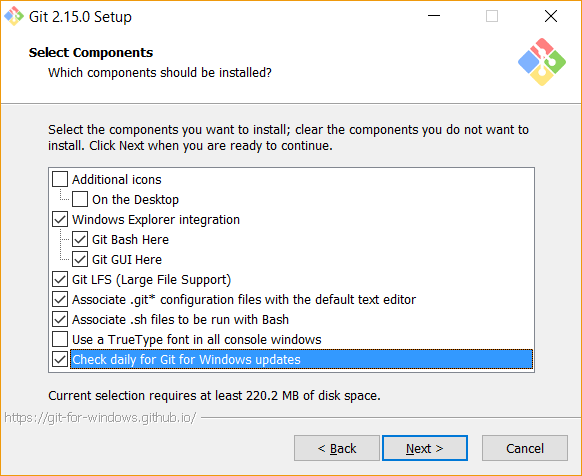

# Git and Gitlab

## Version control and you
What is version control? Version control is a way to track and manage your code as it changes over time.

What is the value that version control provides?
* History
    * It tracks changes in code so you can see how code evolves over time.
    * You can see what changes were made and when.
    * You can see who made what changes.
* Undo
    * At any point, you can go back to a previous checkpoint to see the code at that point in time.
* Teamwork
    * Version control provides branching, allowing multiple people to work on multiple versions of code at the same time.
    * To support branching, version control also provides the ability to merge branches, bringing the multiple versions back together into one.
* Tooling
    * Often, version control systems provide tooling to improve discussion about code and trigger events based on changes to code.

### Vocabulary
* History
    * The checkpoints of code in a version control system. History includes the code changes made, who made them, when they were made, and a message summarizing the change, entered by the user.
* Repository
    * A collection, usually a folder, of code treating as an individual unit with its own history.
* Branch
    * A version of a repository that maintains its own path of history while sharing history with other branches of the same repository
* Remote
    * A copy of a Git repository on another computer

## What are the differences between SVN and Git?
* Git is decentralized. Each copy is a full working copy. The copy of a repository on your laptop is the same as the copy on the server. This means you can commit while offline. You can sync up later. SVN is centralized. You must rely on the server to preserve your changes.
* Branching is easy. It's pretty easy in SVN as well, but branching is a first-class citizen in Git. It also handles remotes much easier.
* The tools are awesome. Github, BitBucket, and Gitlab provide excellent ways to collaborate on code and visualize history.
* Git is harder to learn. It is more flexible, and that means there are more things you need to learn and more possible ways to solve problems.

## First, let's learn the command line
1. Open command line
    * You can be normal by opening `Command Prompt` from the Start Menu.
    * Or you can be fancy and use `Win + r` to open the run dialogue, input `cmd`, and hit enter
2. Practice navigating with `dir` and `cd`
    * Command line is just like browsing folders with Windows Explorer. It shows files and folders. You can enter and exit folders just the same.
    * The `dir` command shows the contents of the current directory. If you do `dir <some_folder>` where `<some_folder>` is a directory, it will show the contents of that directory.
    * The `cd` command is short for change directory. You can do `cd <some_folder>` to change your current location to `<some_folder>`. If you want to go up a folder, use `..`.
    * The `mkdir` command is short for make directory. You can enter `mkdir <some_path>` to create a folder at `<some_path>`.


## Install Git
[Download it!](https://git-scm.com/downloads)

All defaults are okay except those listed below.
##### Check the components you're going to install
The `X Here` utility is really useful.
`Check daily for Git for Windows updates` keeps Git updated. This is always a good idea.



##### Choose your PATH settings
For those less familiar with command line (CLI), the PATH is the list of folders where the operating system will look for executable files. By adding it to the Windows PATH, you can use Git commands from the normal CLI.
Git will also install Git Bash, a Unix-style alternative to the Windows CLI.


## Configure Git
We should tell Git who we are. By doing this, when we push our code up to Gitlab, it knows to tag us with our profile. It keys off of the email; the name does not need to match exactly.
```
config --global user.name
config --global user.email
```

## Setup your project
1. Create a folder for your project.
2. Navigate into this folder using the command line.
3. Run `git init` to create the git repository
    * This creates a `.git` folder that contains a config file (`.git/config`), all of your history, branches, and more.
4. Check the status of your repository with `git status` to ensure it was created properly.

status
 -- create files
add
status
commit
log
-- make changes
diff
reset
-- make more changes
checkout -- file
branch
checkout branch
checkout -b branch
-- add another file
rm
merge
branch -d branch
--make change
add, commit
log
revert
tag <version>
-- make changes, add, commit
tag -a <version> -m <message>
show <tag>

GH - create account
GH - create repo
remote
git push -u origin master
GH - make in-browser changes
pull
-- make changes
add, commit
push origin <tagname>
push origin --tags

-- go to my GH repo for this class
GH - create issue
GH - issue comment

GH - fork
clone
-- add file
commit -m "Closes #5"
GH - pull request
GH - accept

GH - branches
GH - search
GH - star
GH - watch
GH - commit history
GH - wiki
